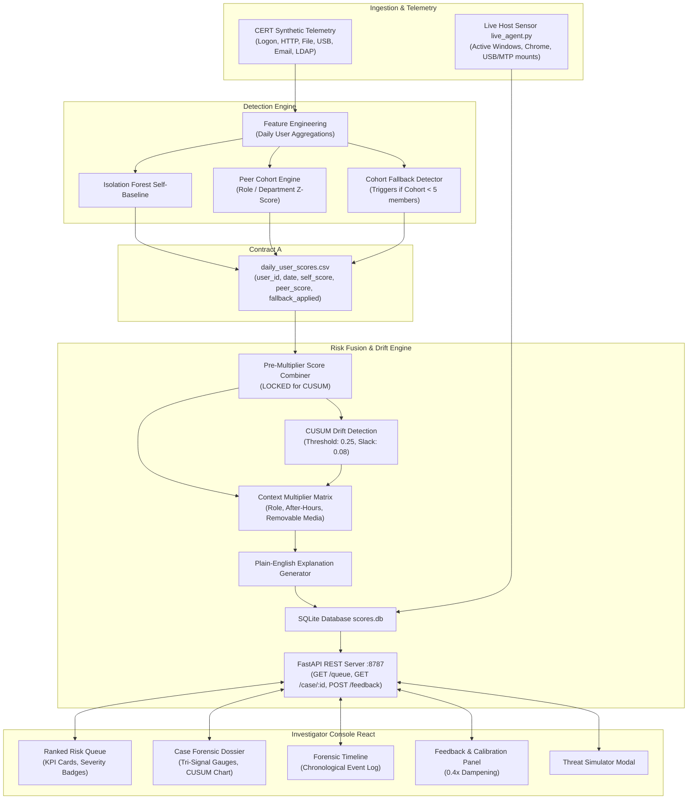

# Silent Shift — Insider Threat Detection Platform

[](https://fastapi.tiangolo.com)
[](https://react.dev)
[](https://www.typescriptlang.org/)
[](https://python.org)
[](https://sqlite.org/)

> A context-aware, enterprise-grade platform that identifies slow and stealthy insider behavioral drifts before exfiltration occurs — combining dual-baseline anomaly detection, CUSUM temporal drift control charting, contextual risk multipliers, and real-time investigator calibration.

---

## Table of Contents

1. [Architecture](#architecture)
2. [Features](#features)
3. [Repository Structure](#repository-structure)
4. [Quick Start](#quick-start)
5. [API Reference](#api-reference)
6. [Testing](#testing)

---

## Architecture



---

## Features

### Dual-Baseline Anomaly Detection

- **Self-Baseline** — Trains an unsupervised `IsolationForest` over each user's 90-day personal activity history to detect individual behavioral deviations.
- **Peer-Cohort Baseline** — Compares activity against organizational peers (by role/department) using robust Z-score distributions.
- **Small-Cohort Fallback** — Automatically switches from role-level to department-level comparison when cohort size drops below 5, with explicit disclosure to the investigator.

### CUSUM Temporal Drift Detection

Evaluates pre-multiplier fused scores using a Cumulative Sum control chart with a **0.25 drift threshold**. The input score is **locked** before multiplier adjustments to prevent artificial distortion of the drift signal.

### Contextual Risk Multipliers

Dynamically scales scores based on role, access time, and data sensitivity:

| Context | Multiplier |
|---|---|
| Admin role | 1.5× |
| Privileged role | 1.3× |
| Access before 7:00 AM | 1.4× |
| Access after 8:00 PM | 1.3× |
| Confidential data | 1.4× |
| Removable media | 1.3× |

Temporal decay is applied automatically when an account returns to normal baseline behavior.

### False-Positive Calibration

Closes the analyst feedback loop to combat alert fatigue:

1. Investigator submits a justification via `POST /feedback`.
2. A **0.4× dampening factor** is applied to the user's fused score.
3. Score drops immediately (e.g., `98 CRITICAL` → `39 LOW`).
4. Account is re-ranked in the queue with a `✓ CALIBRATED FP` badge.
5. An immutable `INVESTIGATOR RESOLUTION` milestone is appended to the forensic timeline.

### Live Host Telemetry Agent

`backend/live_agent.py` turns any Linux workstation into a live detection demo:

- **Active Window Monitoring** via `wmctrl`
- **Chrome History Inspection** for cloud-sharing domains (WeTransfer, OneDrive, Dropbox, MEGA)
- **USB/MTP Storage Sensors** via `lsusb` and `/run/user/$UID/gvfs`

Threat escalation tiers:

| Tier | Score | Trigger |
|---|---|---|
| 1 — Medium | 44/100 | First cloud transfer service visit |
| 2 — High | 75/100 | Removable storage attached near cloud upload; CUSUM crosses threshold |
| 3 — Critical | 98/100 | Multi-vector: removable media + sensitive file + cloud share |

### Interactive Threat Simulator

Built-in dashboard modal for injecting custom insider threat scenarios — configure employee name, role, department, upload target, USB, and after-hours flags — executed through the full detection pipeline in real time.

---

## Repository Structure

```
.
├── backend/
│   ├── api/
│   │   ├── database.py             # SQLite persistence & feedback recalibration
│   │   ├── main.py                 # FastAPI application (Contract B REST endpoints)
│   │   └── models.py               # Pydantic schemas
│   ├── data/
│   │   ├── sample_cert/            # CERT synthetic dataset
│   │   └── scores.db               # SQLite database (scores & timelines)
│   ├── drift/
│   │   └── cusum.py                # CUSUM drift detection engine
│   ├── explain/
│   │   └── generator.py            # Plain-English explanation generator
│   ├── fusion/
│   │   └── fusion.py               # Risk fusion engine with contextual multipliers
│   ├── ingestion/
│   │   ├── cert_loader.py          # CERT CSV parsing & ingestion
│   │   ├── publish.py              # Detection pipeline orchestration
│   │   ├── synthetic_cert.py       # Synthetic CERT data generator
│   │   └── user_day.py             # Daily feature extraction
│   ├── models/
│   │   ├── cohorts.py              # Cohort grouping & small-cohort fallback
│   │   ├── peer_baseline.py        # Peer-cohort Z-score deviation modeling
│   │   └── self_baseline.py        # Isolation Forest self-baseline modeling
│   ├── output/
│   │   └── daily_user_scores.csv   # Contract A interface output
│   ├── tests/
│   │   ├── test_person2.py         # Anomaly detection unit tests
│   │   └── test_person3.py         # CUSUM, fusion & API unit tests
│   ├── live_agent.py               # Live host real-time telemetry monitor
│   ├── pipeline.py                 # Batch pipeline (Contract A → SQLite)
│   └── simulator.py                # Threat simulation injection engine
├── frontend/
│   ├── src/
│   │   ├── components/
│   │   │   ├── CusumChart.tsx      # CUSUM area chart with forensic tooltips
│   │   │   ├── FeedbackControl.tsx # False-positive submission panel
│   │   │   ├── ThreatSimulatorModal.tsx  # Live scenario injection modal
│   │   │   └── Timeline.tsx        # Chronological forensic event log
│   │   ├── pages/
│   │   │   ├── CasePage.tsx        # User case forensic dossier
│   │   │   └── QueuePage.tsx       # Prioritized ranked risk queue
│   │   ├── api.ts                  # Typed client for Contract B endpoints
│   │   ├── App.tsx                 # Route declarations & navigation shell
│   │   └── index.css               # Global theme tokens & glassmorphism
│   ├── package.json
│   ├── start.sh                    # One-command dual server launcher
│   └── vite.config.ts
├── requirements.txt
└── README.md
```

---

## Quick Start

### Prerequisites

| Requirement | Version |
|---|---|
| Python | 3.10 – 3.12 |
| Node.js | 18+ |
| OS | Linux / macOS (Windows via WSL2) |

### 1. Clone & Install

```bash
git clone https://github.com/shammazhere/mit_selection.git
cd mit_selection

# Python environment
python3 -m venv .venv
source .venv/bin/activate
pip install -r requirements.txt

# Frontend dependencies
cd frontend && npm install && cd ..
```

### 2. Run

```bash
bash frontend/start.sh
```

This starts both servers simultaneously:

| Service | URL |
|---|---|
| Backend API | http://127.0.0.1:8787 |
| Frontend Console | http://127.0.0.1:5173 |
| API Docs (Swagger) | http://127.0.0.1:8787/docs |

### 3. Live Telemetry Agent _(optional)_

Open a separate terminal and run the live host sensor:

```bash
source .venv/bin/activate
python backend/live_agent.py
```

Plug in a USB drive or visit a file-sharing site (e.g. `wetransfer.com`) in Chrome — the risk score escalates on the dashboard in real time.

---

## API Reference

### `GET /queue`

Returns the prioritized insider risk queue ranked by fused risk score.

| Parameter | Type | Description |
|---|---|---|
| `min_risk_score` | float | _(optional)_ Minimum risk score filter |
| `severity` | string | _(optional)_ Filter by `low`, `medium`, `high`, or `critical` |

**Response**

```json
[
  {
    "user_id": "U-MOHAMMED",
    "name": "Mohammed Shamaz",
    "role": "Host User (Real System)",
    "team": "Endpoint",
    "risk_score": 98.0,
    "severity": "critical",
    "last_updated": "2026-09-14T01:00:00",
    "fallback_applied": false,
    "is_false_positive": false,
    "feedback_reason": ""
  }
]
```

---

### `GET /case/{user_id}`

Returns the complete forensic dossier for a specific user.

**Response**

```json
{
  "user_id": "U-MOHAMMED",
  "name": "Mohammed Shamaz",
  "risk_score": 98.0,
  "self_score": 0.98,
  "peer_score": 0.94,
  "drift_score": 0.95,
  "pre_multiplier_score": 0.96,
  "adjusted_fusion_score": 1.63,
  "cohort_used": "role",
  "cohort_size": 7,
  "fallback_applied": false,
  "explanation_text": "Critical Exfiltration Pattern (Tier 3): Multi-vector exfiltration detected.",
  "multipliers_applied": {
    "role": 1.0,
    "time": 1.3,
    "data_sensitivity": 1.3,
    "decay": 1.0,
    "feedback_down_weight": 1.0
  },
  "severity": "critical",
  "is_false_positive": false,
  "cusum_path": [...],
  "event_timeline": [...]
}
```

---

### `POST /feedback`

Records an investigator's calibration decision and applies a **0.4× score dampener** immediately.

**Request**

```json
{
  "user_id": "U-MOHAMMED",
  "is_false_positive": true,
  "reason": "Expected activity: legitimate new project assignment"
}
```

**Response**

```json
{
  "ok": true,
  "status": "success",
  "message": "Feedback recorded successfully",
  "feedback_id": "1",
  "down_weight": 0.4,
  "timestamp": "2026-09-14T01:05:13"
}
```

---

### `POST /simulate_threat`

Injects a custom threat scenario through the full detection pipeline.

**Request**

```json
{
  "name": "Jordan Bell",
  "role": "Database Administrator",
  "department": "Infrastructure",
  "team": "Data Engineering",
  "site": "https://mega.nz/upload",
  "file": "customer_pii_vault.tar.gz",
  "after_hours": true,
  "usb": true,
  "cloud_upload": true
}
```

---

## Testing

### Backend

```bash
# Run all backend unit tests
.venv/bin/python3 -m unittest discover backend/tests

# Run individually
.venv/bin/python3 -m unittest backend/tests/test_person2.py
.venv/bin/python3 -m unittest backend/tests/test_person3.py
```

Covers: CERT bundle loading, Isolation Forest score boundaries (0–1), CUSUM drift accumulation, pre-multiplier score locking, contextual multiplier math, fallback disclosures, SQLite persistence, and Contract B API endpoints.

### Frontend

```bash
cd frontend

# Type-check & build production bundle
npm run build

# Run frontend unit tests
npm test
```

---

## License

Developed for **MIT Hackathon — Problem Statement 16 ("Silent Shift")**.  
Designed with ethical data boundaries: no keystroke logging, no message interception, full cohort fallback disclosures, and transparent algorithmic explainability.
