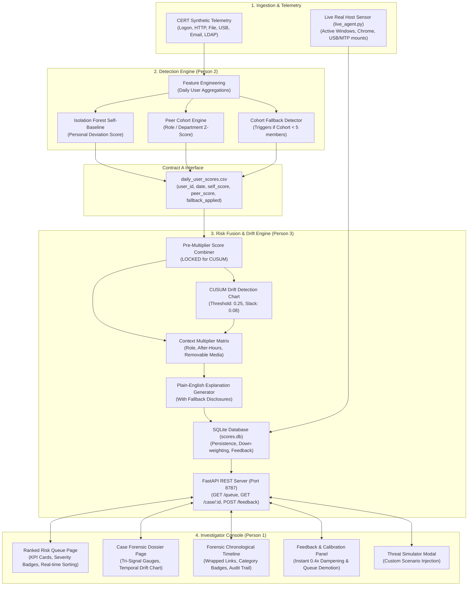

# 🛡️ SILENT SHIFT — Context-Aware Insider Threat Detection & Dynamic Risk Fusion

[](https://fastapi.tiangolo.com)
[](https://react.dev)
[](https://www.typescriptlang.org/)
[](https://vitejs.dev/)
[](https://scikit-learn.org/)
[](https://recharts.org/)
[](https://sqlite.org/)

> **Problem Statement 16 — Silent Shift**: An enterprise-grade, privacy-conscious Insider Threat Detection platform designed to identify slow, low-volume, and stealthy behavioral drifts before catastrophic exfiltration occurs. Combines dual-baseline anomaly detection (Isolation Forest self-baselining + peer cohort deviation), statistical temporal drift (CUSUM control charting on locked pre-multiplier scores), contextual risk multipliers, plain-English explanations with small-cohort fallback disclosures, and dynamic false-positive calibration to eliminate analyst alert fatigue.

---

## 📑 Table of Contents
1. [Key Capabilities & Innovations](#-key-capabilities--innovations)
2. [End-to-End System Architecture](#-end-to-end-system-architecture)
3. [The 3-Person Engineering Breakdown](#-the-3-person-engineering-breakdown)
4. [Live Real-World Spyware Agent (Live Host Monitoring)](#-live-real-world-spyware-agent-live-host-monitoring)
5. [Dynamic False-Positive Calibration (Alert Fatigue Mitigation)](#-dynamic-false-positive-calibration-alert-fatigue-mitigation)
6. [Time-Series Telemetry & Resilient Queue Deduplication](#-time-series-telemetry--resilient-queue-deduplication)
7. [Interactive Threat Simulator](#-interactive-threat-simulator)
8. [Repository Structure](#-repository-structure)
9. [Quick Start Guide](#-quick-start-guide)
10. [API Specification (Contract B REST Interface)](#-api-specification-contract-b-rest-interface)
11. [Automated Verification & Test Suite](#-automated-verification--test-suite)

---

## ⚡ Key Capabilities & Innovations

* **Dual-Baseline Anomaly Modeling**:
  * **Self-Baseline**: Trains unsupervised Isolation Forests over 90-day personal activity histories to detect personal deviations without assuming rigid corporate rules.
  * **Peer-Cohort Baseline**: Normalizes activity against organizational peers (e.g. role, department) using robust Z-score distributions.
* **Small-Cohort Transparent Fallback Disclosures**:
  * Automatically switches comparison from specific roles to broader departments when cohort size is small ($N < 5$), preventing small-sample skew while explicitly disclosing the fallback to the investigator.
* **Locked CUSUM Temporal Drift Control Chart**:
  * Evaluates pre-multiplier fused scores ($S_t = \max(0, S_{t-1} + (x_t - \mu) - k)$) with a $0.25$ drift threshold. The input score is **locked** so that later multiplier adjustments cannot artificially distort the drift signal.
  * Plotted on a glassmorphic interactive chart with **exact real-time event timestamps** (e.g., `11:49:17 PM`, `11:53:17 PM`) and rich hover tooltips detailing the exact triggering forensic action.
* **Contextual Risk Multipliers & Decay**:
  * Dynamically scales scores based on **Role Privilege** (1.3×–1.5× for Admin/Privileged roles), **Access Hours** (1.3×–1.4× for before 7:00 AM or after 8:00 PM), and **Data Sensitivity** (1.3×–1.4× for removable media / cloud exfiltration targets).
  * Automatically applies temporal decay when accounts return to normal baseline behavior.
* **Dynamic False-Positive Calibration (0.4× Dampening)**:
  * When an investigator records a false positive, a **0.4× dampening factor** is applied in real time.
  * The risk score immediately drops (e.g. 98 down to 39/100, demoting severity from `CRITICAL` to `LOW`), the account is re-ranked down the queue with a green `✓ CALIBRATED FP` badge, and an immutable `INVESTIGATOR RESOLUTION` audit milestone is logged to the forensic timeline.
* **Real Host Telemetry Spyware Agent**:
  * A lightweight background daemon (`backend/live_agent.py`) monitoring actual OS desktop windows (`wmctrl`), Google Chrome visits, and USB/MTP storage mounts (`lsusb`, `/run/user/$UID/gvfs`), streaming live events into the dashboard with zero synthetic dummy data.

---

## 🏗️ End-to-End System Architecture



---

## 👥 The 3-Person Engineering Breakdown

This platform is structured around three modular, decoupled layers aligned with industry team separation:

### Person 1 — Frontend Investigator Console
* **Directory**: `frontend/src/`
* **Technologies**: React 19, TypeScript, Vite, Recharts, Vanilla CSS Design System.
* **Key Modules**:
  * `QueuePage.tsx`: Prioritized analyst queue with live KPI cards, search, severity chips, and calibrated false-positive badges.
  * `CasePage.tsx`: Detailed forensic dossier featuring tri-signal anomaly breakdown (Self, Peer, Drift), transparent fallback disclosures, dynamic text wrapping for long URLs, and the investigator feedback widget.
  * `CusumChart.tsx`: High-resolution area chart plotting exact time-based drift points with custom dark-mode hover tooltips detailing trigger actions and threshold indicators.
  * `Timeline.tsx`: Chronological drill-down of all host and network telemetry events with category badges (`EXFILTRATION`, `DEVICE/USB`, `AFTER-HOURS AUTH`, `INVESTIGATOR RESOLUTION`).
  * `ThreatSimulatorModal.tsx`: Interactive modal for testing custom insider threat scenarios on demand.

### Person 2 — Anomaly Detection & Baseline Engine
* **Directory**: `backend/ingestion/`, `backend/models/`
* **Technologies**: Python, Pandas, Scikit-Learn, NumPy.
* **Key Modules**:
  * `user_day.py`: Aggregates raw logs across five activity vectors (logon, file, USB, HTTP, email) into daily feature matrices.
  * `self_baseline.py`: Fits an unsupervised `IsolationForest` per user across historical baselines to compute normalized personal anomaly scores ($0.0 - 1.0$).
  * `peer_baseline.py`: Groups users into cohorts by job title and department; computes robust peer deviation metrics.
  * `cohorts.py`: Enforces minimum cohort size ($N \ge 5$); flags `fallback_applied = True` when small role groups fall back to department-level comparisons.
  * **Output Contract**: Emits **Contract A** (`backend/output/daily_user_scores.csv`).

### Person 3 — Risk Fusion, CUSUM Drift, Explanations & Contract B API
* **Directory**: `backend/drift/`, `backend/fusion/`, `backend/explain/`, `backend/api/`
* **Technologies**: FastAPI, Uvicorn, SQLite, Dataclasses.
* **Key Modules**:
  * `cusum.py`: Statistical Cumulative Sum (CUSUM) drift detector running on locked pre-multiplier scores.
  * `fusion.py`: Calculates unified $0-100$ fused risk scores and applies contextual multipliers for administrative privileges, off-hours access, and sensitive data handling.
  * `generator.py`: Generates human-readable, plain-English rationales for why an account was flagged, explicitly disclosing cohort fallback adjustments.
  * `database.py`: Thread-safe SQLite persistence layer for risk scores, forensic timelines, and investigator feedback calibrations.
  * `main.py`: Production FastAPI REST API serving **Contract B** endpoints with CORS, validation, and live reload.

---

## 🕵️ Live Real-World Spyware Agent (Live Host Monitoring)

Rather than relying purely on static synthetic datasets, Silent Shift includes a live endpoint sensor (`backend/live_agent.py`) capable of turning your local workstation into a live demonstration host:

* **Dynamic User & Host Discovery**: Reads `/etc/passwd` and system environment to automatically identify the host username and real employee name (e.g. `Mohammed Shamaz` / `U-MOHAMMED`).
* **Active Window Monitoring**: Uses `wmctrl` to detect active browser sessions, cloud storage windows, and confidential files in real time.
* **Live Chrome History Integration**: Inspects the local Chrome SQLite history file to capture real-world visits to file-sharing services (`wetransfer.com`, `onedrive.live.com`, `dropbox.com`, `mega.nz`, etc.).
* **Hardware & Storage Mount Sensors**: Watches `/run/user/$UID/gvfs`, `/media/$USER`, and `lsusb` to immediately flag USB storage devices and Android MTP smartphone mounts.
* **Clean Baseline Initialization**: Purges old synthetic rows on startup, creating a clean low-risk baseline ($5/100$) with zero dummy events.
* **Real-Time Threat Escalation**:
  * **Tier 1 (Medium Threat — 44/100)**: First observed access to external cloud transfer services.
  * **Tier 2 (High Threat — 75/100)**: Removable storage attached in proximity to cloud upload activity; CUSUM crosses the $0.25$ drift threshold.
  * **Tier 3 (Critical Threat — 98/100)**: Multi-vector exfiltration combining removable media transfer, sensitive file editing, and cloud sharing links.

---

## 🎯 Dynamic False-Positive Calibration (Alert Fatigue Mitigation)

In high-volume enterprise SOCs, alert fatigue causes real threats to be missed. Silent Shift implements a closed-loop feedback calibration workflow:

1. **Investigator Submission**: The analyst selects a justification preset (e.g. *"Expected activity: legitimate new project assignment"*) and submits via `POST /feedback`.
2. **0.4× Model Down-Weighting**: The fusion engine applies a $0.4\times$ multiplier (`feedback_down_weight = 0.4`) to the user's score in `scores.db`.
3. **Instant Severity Demotion**: A critical score of **98.0** drops immediately to **39.2 (LOW)**, changing the severity badge from red to green.
4. **Queue Re-Ranking**: The account falls from the top of the queue down below active investigation targets, labeled with a green `✓ CALIBRATED FP` badge.
5. **Auditable Forensic Milestone**: An immutable `INVESTIGATOR RESOLUTION` event is appended to the case timeline, and a downward calibration point is plotted on the CUSUM curve.
6. **Live Sensor Awareness**: The background `live_agent.py` detects the active calibration and maintains the dampened score for subsequent actions, avoiding regressive alert spam.

---

## 🗄️ Time-Series Telemetry & Resilient Queue Deduplication

Enterprise UEBA systems must balance two competing requirements:
1. **Chronological Time-Series Storage**: Preserving historical daily snapshots for temporal drift analysis, audit trails, and CUSUM curve reconstruction.
2. **De-Duplicated Triage Experience**: Ensuring security analysts triaging the queue see each employee or host account **exactly once**, displaying their latest evaluated risk score without redundant day-over-day duplicate cards.

### Two-Tier Deduplication Architecture

```
┌─────────────────────────────────────────────────────────────┐
│                   SQLite: risk_scores                       │
│  PK: (user_id, date)                                        │
│  - C1004 (2026-09-13): 46.0 Medium                          │
│  - C1004 (2026-09-14): 46.0 Medium  <-- Latest Record       │
│  - U-MOHAMMED (2026-09-14): 38.4 Low [FP Calibrated]        │
│  - C1001 (2026-09-14): 22.5 Low                             │
└──────────────────────────────┬──────────────────────────────┘
                               │
               SQL Inner Join on MAX(date)
               GROUP BY user_id
                               │
                               ▼
┌─────────────────────────────────────────────────────────────┐
│                 FastAPI REST: /queue                        │
│  Returns 3 Unique Accounts Ranked by Latest Risk Score:     │
│  1. Elena Vance (C1004)       - 46.0 Medium                 │
│  2. Mohammed Shamaz (U-MOH)   - 38.4 Low (Calibrated FP)    │
│  3. Alex Rivera (C1001)       - 22.5 Low                    │
└──────────────────────────────┬──────────────────────────────┘
                               │
               Defense-in-Depth Map Deduplication
                               ▼
┌─────────────────────────────────────────────────────────────┐
│             Investigator Console (React UI)                 │
│  - KPI Counters: 3 Total Flagged Accounts                   │
│  - Zero Duplicate Rows                                      │
│  - Dynamic URL Text-Wrapping (No Horizontal Blowout)        │
└─────────────────────────────────────────────────────────────┘
```

* **Database Engine**: Uses an `INNER JOIN` on `(SELECT user_id, MAX(date) AS max_date FROM risk_scores GROUP BY user_id)` with `GROUP BY r.user_id` so date rollovers (e.g. crossing midnight) never duplicate accounts in the triage queue.
* **Frontend Defense-in-Depth**: `QueuePage.tsx` maintains a Map-keyed unique set on `user_id` during state transitions, guaranteeing UI stability even during high-frequency telemetry polling.
* **Feedback Persistence Across Days**: False-positive resolutions are permanently tracked in the `feedback` audit table, ensuring model down-weighting ($0.4\times$) and green badge indicators carry across date boundaries seamlessly.

---

## 🧪 Interactive Threat Simulator

The dashboard includes a built-in **Threat Simulator** accessible via the header button on the Queue page:

* Allows testing custom employee names, roles, departments, target upload domains, and sensitive file names.
* Configurable toggles for **After-Hours Activity**, **USB Storage Connections**, **Confidential Document Handling**, and **Cloud Uploads**.
* Executes the complete Person 3 pipeline and injects the new threat into the live queue in real time without restarting servers.

---

## 📁 Repository Structure

```
.
├── backend/
│   ├── api/
│   │   ├── database.py             # SQLite persistence layer & feedback recalibration
│   │   ├── main.py                 # FastAPI application (Contract B REST endpoints)
│   │   └── models.py               # Pydantic & Dataclass schemas
│   ├── data/
│   │   ├── sample_cert/            # CERT synthetic dataset (device, email, file, http, ldap, logon)
│   │   └── scores.db               # SQLite database caching live scores & timelines
│   ├── drift/
│   │   └── cusum.py                # CUSUM Cumulative Sum drift detection engine
│   ├── explain/
│   │   └── generator.py            # Plain-English explanation & fallback disclosure generator
│   ├── fusion/
│   │   └── fusion.py               # Risk fusion engine with 4 contextual multipliers
│   ├── ingestion/
│   │   ├── cert_loader.py          # CERT CSV parsing & bundle ingestion
│   │   ├── publish.py              # Person 2 pipeline orchestration
│   │   ├── synthetic_cert.py       # Synthetic CERT data generator
│   │   └── user_day.py             # Daily feature extraction
│   ├── models/
│   │   ├── cohorts.py              # Cohort grouping & small-cohort fallback detection
│   │   ├── peer_baseline.py        # Peer-cohort deviation modeling (Z-score)
│   │   └── self_baseline.py        # Self-baseline Isolation Forest modeling
│   ├── output/
│   │   ├── daily_user_scores.csv   # Person 2 -> Person 3 Contract A interface output
│   │   └── daily_user_scores.sqlite
│   ├── tests/
│   │   ├── test_person2.py         # Anomaly detection & feature unit tests
│   │   └── test_person3.py         # CUSUM drift, fusion, and Contract B API unit tests
│   ├── generate_sample_data.py     # Standalone Contract A sample generator
│   ├── live_agent.py               # Live host real-time spyware telemetry monitor
│   ├── pipeline.py                 # Batch processing pipeline (Contract A -> SQLite)
│   └── simulator.py                # Simulation injection engine
├── frontend/
│   ├── src/
│   │   ├── components/
│   │   │   ├── CusumChart.tsx      # Time-based CUSUM area chart with forensic tooltips
│   │   │   ├── FeedbackControl.tsx # False-positive submission & justification panel
│   │   │   ├── ThreatSimulatorModal.tsx # Live custom scenario injection modal
│   │   │   └── Timeline.tsx        # Forensic chronological event log with text wrapping
│   │   ├── pages/
│   │   │   ├── CasePage.tsx        # Individual user case forensic dossier
│   │   │   └── QueuePage.tsx       # Prioritized ranked risk queue
│   │   ├── api.ts                  # Typed client interface to Contract B endpoints
│   │   ├── App.tsx                 # Route declarations & navigation shell
│   │   └── index.css               # Global theme tokens, typography, glassmorphism
│   ├── package.json
│   ├── start.sh                    # One-command dual server launcher
│   └── vite.config.ts
├── requirements.txt                # Unified Python dependency specifications
└── README.md
```

---

## 🚀 Quick Start Guide

### Prerequisites
* **Python**: 3.10, 3.11, or 3.12
* **Node.js**: 18+ (with `npm`)
* **OS**: Linux / macOS (Windows via WSL2)

### 1. Clone & Environment Setup
```bash
git clone https://github.com/shammazhere/mit_selection.git
cd mit_selection

# Create and activate Python virtual environment
python3 -m venv .venv
source .venv/bin/activate

# Install backend dependencies
pip install -r requirements.txt

# Install frontend dependencies
cd frontend
npm install
cd ..
```

### 2. Launch the Application (One-Command)
Run the startup script from the root or `frontend` directory:
```bash
bash frontend/start.sh
```

This automatically:
1. Starts the **FastAPI Backend** on `http://127.0.0.1:8787`
2. Starts the **Vite Frontend Console** on `http://127.0.0.1:5173` (or `5174`)

Open your browser and navigate to **`http://127.0.0.1:5173/`** to access the Investigator Console.

### 3. (Optional) Run the Live Telemetry Agent
To demonstrate live real-world detection from your own machine, open a separate terminal:
```bash
source .venv/bin/activate
python backend/live_agent.py
```
* Now, plug in a USB flash drive or visit a file-sharing site (e.g. `https://wetransfer.com/`) in Google Chrome.
* The agent detects the event in real time and automatically escalates your risk score on the live dashboard.

---

## 🔌 API Specification (Contract B REST Interface)

### `GET /queue`
Returns the prioritized insider risk queue sorted by fused risk score.
* **Query Parameters**:
  * `min_risk_score` *(optional, float)*: Minimum risk threshold filter.
  * `severity` *(optional, string)*: Filter by `low`, `medium`, `high`, `critical`.
* **Response**:
```json
[
  {
    "user_id": "U-MOHAMMED",
    "name": "Mohammed Shamaz",
    "role": "Host User (Real System)",
    "team": "Endpoint",
    "risk_score": 98.0,
    "severity": "critical",
    "last_updated": "2026-09-14T01:00:00",
    "fallback_applied": false,
    "is_false_positive": false,
    "feedback_reason": ""
  }
]
```

### `GET /case/{user_id}`
Returns complete forensic details for a specific user.
* **Response**:
```json
{
  "user_id": "U-MOHAMMED",
  "name": "Mohammed Shamaz",
  "role": "Host User (Real System)",
  "team": "Endpoint",
  "risk_score": 98.0,
  "self_score": 0.98,
  "peer_score": 0.94,
  "drift_score": 0.95,
  "pre_multiplier_score": 0.96,
  "raw_fusion_score": 0.98,
  "adjusted_fusion_score": 1.63,
  "cohort_used": "role",
  "cohort_size": 7,
  "fallback_applied": false,
  "explanation_text": "Critical Exfiltration Pattern (Tier 3): Multi-vector exfiltration detected. Combination of cloud file transfer, removable storage connection, and sensitive local file handling.",
  "cusum_path": [
    {
      "time": "11:48:00 PM",
      "timestamp": "2026-09-13T23:48:00",
      "value": 0.0,
      "label": "BASELINE",
      "event": "Host baseline active"
    },
    {
      "time": "11:53:17 PM",
      "timestamp": "2026-09-13T23:53:17",
      "value": 0.95,
      "label": "EXFILTRATION",
      "event": "Web upload visit to https://onedrive.live.com/"
    }
  ],
  "event_timeline": [
    {
      "timestamp": "2026-09-13T23:53:17",
      "event": "Web upload visit to https://onedrive.live.com/ (Live at 11:53:17 PM)",
      "category": "http"
    }
  ],
  "severity": "critical",
  "multipliers_applied": {
    "role": 1.0,
    "time": 1.3,
    "data_sensitivity": 1.3,
    "decay": 1.0,
    "feedback_down_weight": 1.0
  },
  "is_false_positive": false,
  "feedback_reason": ""
}
```

### `POST /feedback`
Records an investigator's calibration decision, immediately applying a 0.4× score dampener.
* **Payload**:
```json
{
  "user_id": "U-MOHAMMED",
  "is_false_positive": true,
  "reason": "Expected activity: legitimate new project assignment"
}
```
* **Response**:
```json
{
  "ok": true,
  "status": "success",
  "message": "Feedback recorded successfully",
  "feedback_id": "1",
  "down_weight": 0.4,
  "timestamp": "2026-09-14T01:05:13"
}
```

### `POST /simulate_threat`
Dynamically injects a customized threat scenario through the full detection pipeline.
* **Payload**:
```json
{
  "name": "Jordan Bell",
  "role": "Database Administrator",
  "department": "Infrastructure",
  "team": "Data Engineering",
  "site": "https://mega.nz/upload",
  "file": "customer_pii_vault.tar.gz",
  "email": "leaks@external.org",
  "after_hours": true,
  "usb": true,
  "removable_media": true,
  "cloud_upload": true
}
```

---

## 🧪 Automated Verification & Test Suite

The repository includes a comprehensive, multi-layer testing harness:

### 1. Python Unit Tests (Person 2 & Person 3)
```bash
# Run all backend unit tests
.venv/bin/python3 -m unittest discover backend/tests

# Or run modules individually:
.venv/bin/python3 -m unittest backend/tests/test_person2.py
.venv/bin/python3 -m unittest backend/tests/test_person3.py
```
* **Coverage**: Verifies CERT bundle loading, Isolation Forest score boundaries ($0-1$), CUSUM drift accumulation on sustained mean shifts, pre-multiplier score locking, contextual multiplier math, fallback disclosure generation, SQLite persistence, and FastAPI Contract B endpoints.

### 2. Frontend Test Suite & Production Bundle Build
```bash
cd frontend

# Verify TypeScript type safety and compile production bundle
npm run build

# Run frontend unit tests
npm test
```

---

## ⚖️ License & Hackathon Context

Developed for **MIT Hackathon — Problem Statement 16 ("Silent Shift")**.  
Designed with ethical data boundaries: zero keystroke logging, zero message interception, full cohort fallback disclosures, and transparent algorithmic explainability.
